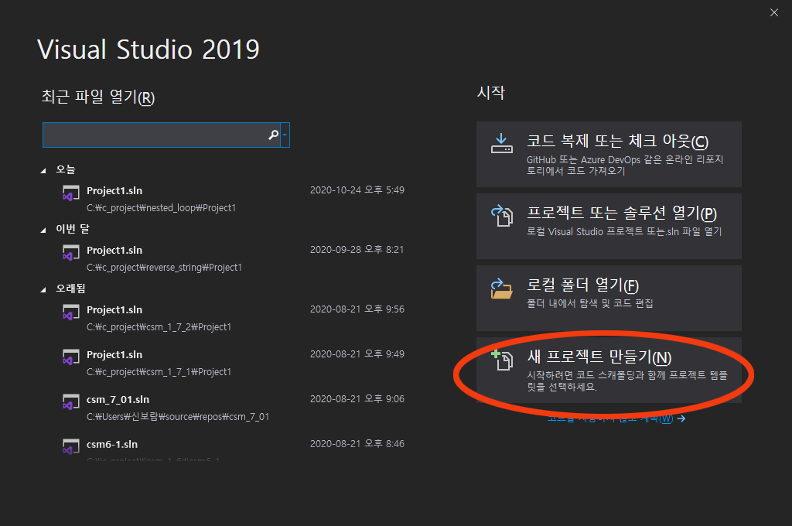
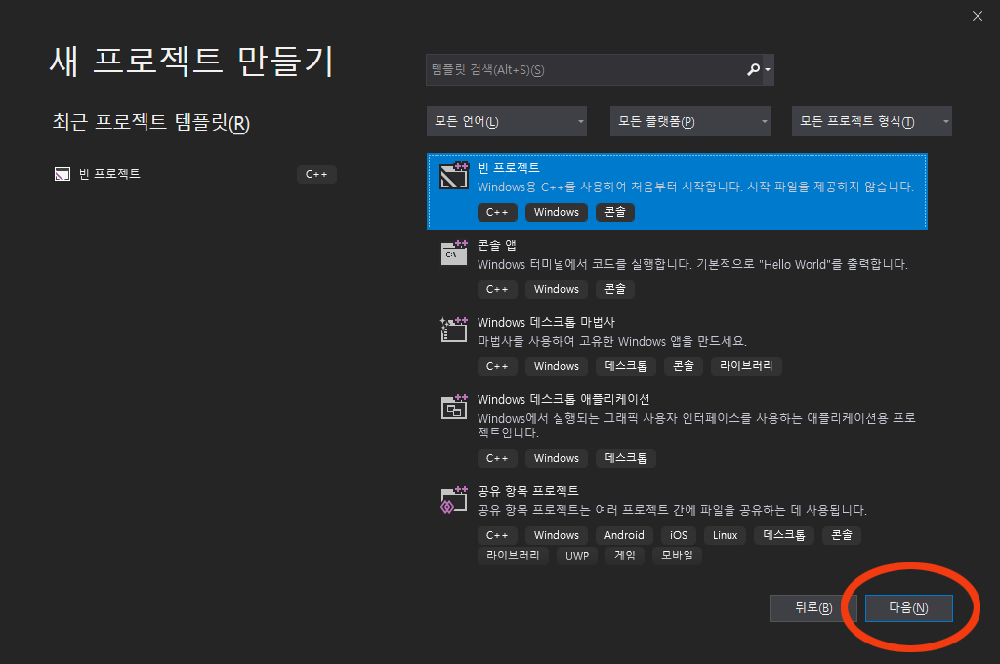
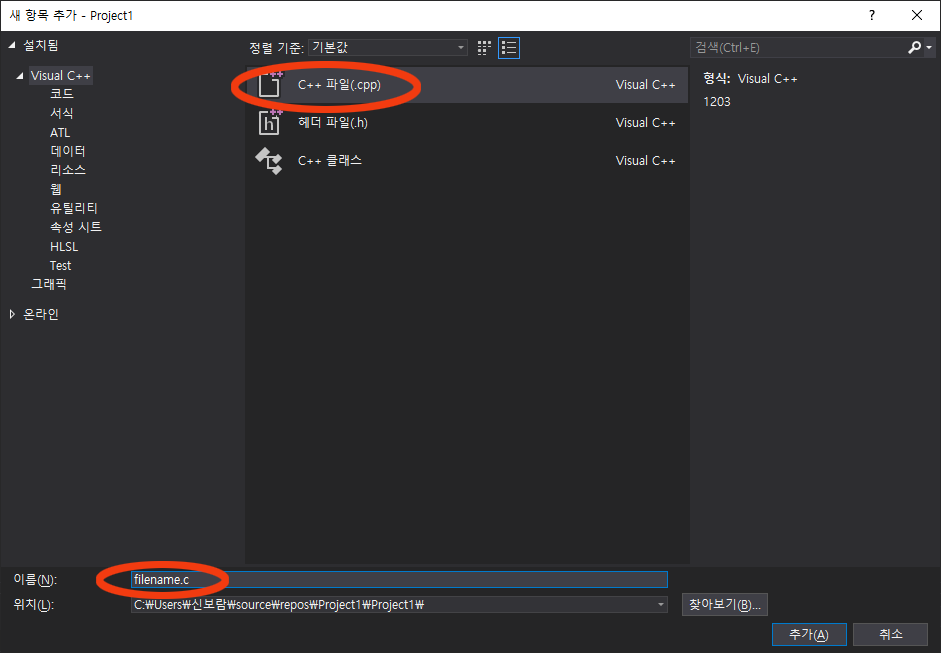

## Visual Studio 프로그램 다운로드
* 커뮤니티 무료 버전을 다운 받는다.  
  [비주얼 스튜디오 다운로드 링크](https://visualstudio.microsoft.com/ko/downloads/)

## 프로그램 설치하기

## 파일 열기
### 새 프로젝트 선택


### 빈 프로젝트 선택


### 프로젝트 이름, 저장 위치 설정
- 프로젝트 이름 규칙: 
  - 예제: Dayxx_배우는 내용_ex 예) Day01_variable_ex01
  - 퀴즈: Dayxx_배우는 내용_quiz 예) Day01_variable_quiz01
- 저장 위치: D드라이브 \ 본인 이름 \ workspace

### C언어 파일 만들기
- 우측 소스파일 우클릭 > 추가 > 새 항목 
- C++ 파일 선택 후 **파일이름.c** 로 설정 후 추가


### 기본 코드 작성
```
#include<stdio.h>

int main() {
  printf("Hello, world!");

  return 0;
}
```
